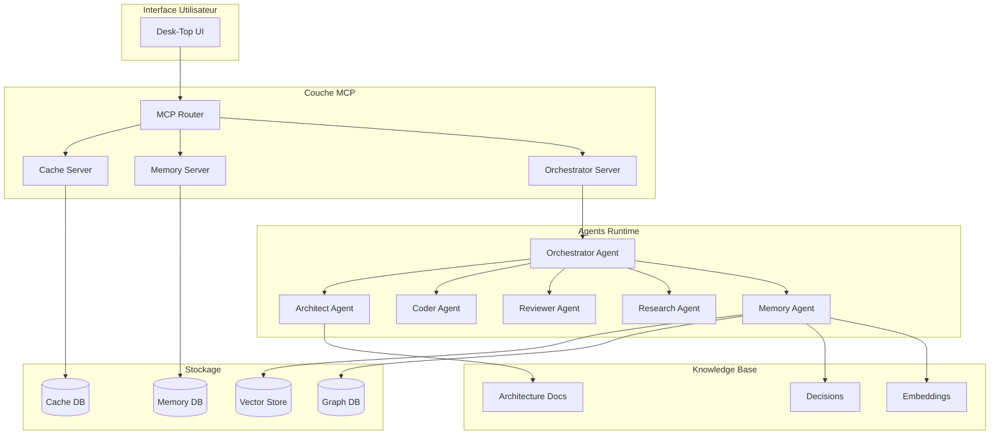

# Vue d'Ensemble du Système Cascade

## Architecture Globale

## Composants Principaux

### 1. Interface Utilisateur (Desk-Top)
- Interface web moderne avec React
- Accès direct aux configurations MCP
- Tableau de bord des agents
- Visualisation des connaissances

### 2. Couche MCP (Model Context Protocol)
- **Router**: Orchestration des requêtes
- **Cache**: Accès rapide aux données
- **Memory**: Gestion des connaissances
- **Orchestrator**: Coordination des agents

### 3. Agents Spécialisés
- **Orchestrator**: Coordination globale
- **Architect**: Conception et architecture
- **Coder**: Implémentation
- **Reviewer**: Assurance qualité
- **Research**: Recherche et veille
- **Memory**: Gestion de la mémoire

### 4. Bases de Données
- **Cache**: Redis pour les données chaudes
- **Memory**: SQLite pour les connaissances
- **Vector**: Qdrant/Zvec pour la recherche sémantique
- **Graph**: Neo4j/SQLite pour les relations

### 5. Base de Connaissances
- **Architecture**: Documentation système
- **Decisions**: ADRs et choix techniques
- **Embeddings**: Représentations vectorielles

## Flux de Données

1. **Requête Utilisateur** → UI
2. **UI** → MCP Router
3. **Router** → Agent approprié
4. **Agent** → Bases de données
5. **Résultat** → UI

## Sécurité

- Authentification JWT
- Chiffrement des données sensibles
- Isolation des agents
- Audit logging complet

## Performance

- Cache multi-niveaux
- Parallélisation des tâches
- Optimisation des requêtes
- Monitoring en temps réel